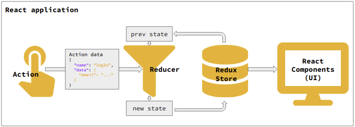
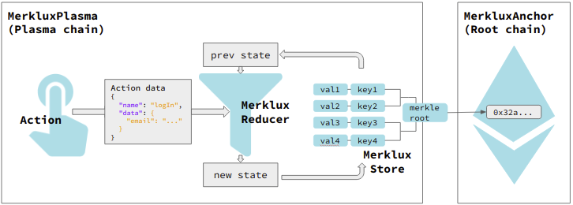
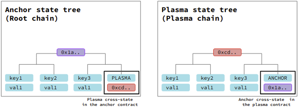
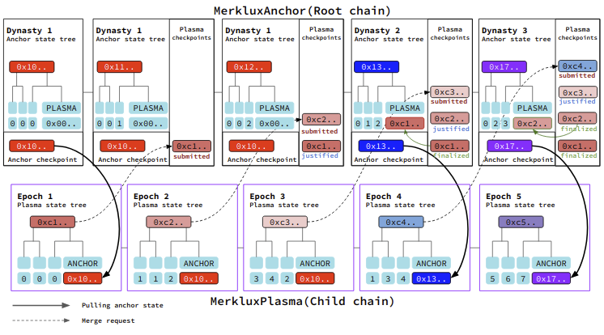

## Introduction

Merklux is a framework that provides a general state plasma solution with economic incentives to operate the plasma chain. The name Merklux was used because this uses the Flux pattern to manage the plasma chain's Merkle tree to be verifiable on the root chain. Through the Flux pattern, we can run a general state plasma chain with main-net level security with a challenge system against data-withholding situations, invalid state transitions, and failure in duty to update the plasma chain.

Also, Merklux uses Casper PEPoW to mitigate the data availability problem and provide economic incentives for submitting compressed transactions. Casper PEPoW is proof of stake algorithm with priority exponential proof of work. Using Casper PEPoW, plasma checkpoint proposers are randomly selected, and they have different priorities to propose a new checkpoint. To propose a new checkpoint, the proposer should submit the proof of work whose difficulty is exponential to its priority. Each checkpoint provides a reward for voting, which is also exponential to the priority of the proposer. Most of all, because the cutting-in checkpoint with hash power may not be chosen by the validators, we can run the PoW system with a low-hashrate standard hash power while giving economic incentives to submit data to the root chain and mitigate the data-availability problem.

Let's deeply dive more into how Merklux works in practice.

## Merkle tree + Flux pattern

When we develop a single page web application, we usually use a Flux pattern to manage the whole state of the application. It makes it much easier to debug the application with the uni-directional data flow. For example, Redux, a Flux implementation for React applications, manages the whole state of the application using a Redux store. In Redux, dispatching an action is the only way to update the Redux store. When an action is dispatched by clicking something or fetching from a server, registered "Reducer" returns a new state by map-reducing the previous state. Then React components update its state by the new state of the Redux store. This kind of uni-directional data flow offers a concrete way to track how the UI changed by which event. You can see how Redux works below:

 

Merklux borrows the Redux pattern to manage the state transitions in the plasma chain. Then, we can track how the state changes if there is dispatch history. The difference with Redux is that Merklux manages its state using a smart contract which implements the Merkle tree data structure. Through applying the Flux pattern with the Merkle tree, the state transitions occurred in the plasma chain can be easily verified on the root chain. Furthermore, if we use a Merkle tree, we can read the plasma chain's state on the root chain using a simple Merkle proof.

 

## Verifiable state transitions

### Writing a reducer

In Merklux, writing a reducer is equivalent to writing a smart contract for the child chain. A Merklux reducer should follow the standard interface as a reducer.

```solidity
import "../MerkluxReducer.sol";

contract TransferReducer is MerkluxReducer {
    function reduce(
        IStateTree _tree,
        address _from,
        bytes memory _encodedParams // encoded params
    ) public returns (
        bytes memory _encodedPairs // encoded key value pairs
    ) {
        // 1. Decode data
        (uint _amount, address _to) = abi.decode(_encodedParams, (uint, address));

        // 2. Calculate
        bytes memory _senderKey = abi.encodePacked(_from);
        bytes memory _receiverKey = abi.encodePacked(_to);
        uint _senderBalance = _tree.read(_senderKey).toRlpItem().toUint();
        uint _receiverBalance = _tree.read(_to).toRlpItem().toUint();
        require(_senderBalance >= _amount);

        // 3. Return pairs to update
        ReducerUtil.RlpData memory pairs;
        pairs = pairs.addUint(_senderKey, _senderBalance - amount);
        pairs = pairs.addUint(_receiverKey, _receiverBalance + _amount);
        return pairs.encode();
    }
}
```

Every reducer should contain three parts:

1. Decode parameters.
2. Read stored key-value pairs and get new key-value pairs to update.
3. Encode key-value pairs to return.

When a reducer reads stored values, it should use the `IStateTree.read()` function. This function records the referred key-value pairs that can make it easy to construct a partial Merkle tree for a challenge later. If we make a reducer a "view" function, we have to submit all key-value pairs of the Merkle tree for a challenge due to the lack of information about referred keys. This is the reason why the reducer function does not have the "view" type of state mutability even though reducers should follow the functional programming pattern. Because of this current limitation, we need to audit a reducer before deploying it to the Merklux whether it is practically a "view" function if we ignore the fact that `IStateTree.read()` uses `SSTORE` opcode.

### Deploying a reducer

When Merklux updates its state, it decides which reducer to use by getting a corresponding reducer hash to the action name from its Merkle tree. This means that the Merkle tree should contain the following key-value pair:

```javscript
{ key: "action name", value: "0x_HASH_VALUE_OF_THE_REDUCER" }
```

To register a new reducer, you should dispatch a deployment action. This can be performed by the Merklux javascript library:
```javascript
let actionName = "Transfer"
let transferReducer = require('TransferReducer.json') // build artifact
await merklux.deployReducer(actionName, transferReducer.bytecode)
```
The reducer is deployed to the root chain first and reflected on the child chain from the next dynasty. You can make the plasma application more secure by disabling the new deployment irreversibly.

In more detail, the `MerkluxRegistry` contract receives the bytecode of the reducer and executes on-chain deployment. `MerkluxRegistry` manages the deployed reducers using a map that sets the hash value of the bytecode as the key and the deployed address as the value for the hash.

### Dispatching an action to the plasma chain

If you dispatch an action, the reducer finds the corresponding reducer from the registry and updates the state tree.

1. `_action`
: string value to specify the reducer. Merklux finds the hash value of the reducer from the plasma state tree. Then, it retrieves the reducer from the reducer registry by using the hash key.

2. `_data`
: It passes parameters as an encoded data using `abi.encode() `

3. `_prevEpoch`
: An action data is only able to be dispatched regarding a specific epoch.

4. `_actionNonce`
: To dispatch an action, a user should fetch an action nonce value for the epoch and include it in the parameter set. Each user has each action nonce value, which starts from 0 and increases by the user's action dispatch. The action nonce is reset to 0 every epoch. It prevents Merklux from dispatching one action several times.

5. `_deployReducer`
: boolean value to reveal that it is deploying a reducer. If the value is true, MerkluxVM recognizes the received data as a bytecode of the new reducer.

6. `_signature`
: ECDSA signature

```solidity
function dispatch(
        string _action,
        bytes _data,
        bytes32 _prevEpoch,
        uint256 _actionNonce,
        bool _deployReducer,
        bytes _signature
) public {
    super.reduce(_action, _data, _prevEpoch, _nonce, _deployReducer, _signature);
}
```

If an action is dispatched to the plasma chain, MerkluxVM updates three Merkle trees and the action nonce map. MerkluxVM then resets the action tree, reference tree, and the action nonce map every epoch.

1. State tree
2. Action tree
3. Reference tree
4. Action nonce map

### Reenacting the state transition across the EVM-based chain

If there are two plasma checkpoints, we can prove that one is the direct child of the other by reenacting state transitions. First, to reenact the state transitions, we submit referred branches of the state tree during the epoch to construct a partial tree for the basis. The submitted keys also construct a reference tree, and finally, it should have the same root hash value as the child checkpoint's reference tree. In the second step, we submit all action data during the epoch, and then they construct the action tree until it becomes equal to the child checkpoint's action tree root value. Finally, MerkluxVM executes the submitted actions in numerical order.

 

## Cross-state items

To be more specific about the data structure, Merklux deploys contracts both to the root chain and the child chain:

To the root chain:

1. MerkluxAnchor
2. MerkluxRegistry

To the child chain:

1. MerkluxPlasma
2. MerkluxRegistry

`MerkluxAnchor` contract has a Merkle tree for its state which is called anchor state tree. Anchor state tree contains a special key-value pair which can be updated only by a "finalization of a plasma checkpoint" which key is "PLASMA" and value is the root hash of the Plasma state tree. This item is called plasma cross-state and looks like:
```javascript
// Plasma cross-state item in the anchor state tree
{ key: 'PLASMA', value: '0xPLASMA_STATE_ROOT_HASH' }
```

`MerkluxPlasma` contract also has its own Merkle tree for its state which is called the "plasma state tree" Like `MerkluxAnchor`, it also contains a special key-value pair which can be updated only by "pulling anchor state," which has "ANCHOR" for its key and the root hash of the anchor state tree for its value. This item is called anchor cross-state and looks like 
```javascript
// Anchor cross-state item in the plasma state tree
{ key: 'ANCHOR', value: '0xANCHOR_STATE_ROOT_HASH' }
```
Merklux uses the cross-state items to read the plasma state on the root chain or in the opposite way.

 

## Cross-checkpoint

There are two kinds of checkpoints in Merklux. One is the anchor checkpoint, and the other is the plasma checkpoint.

An anchor checkpoint is a snapshot of the root hash of the anchor state tree for a dynasty. The genesis state becomes the initial anchor checkpoint. When a plasma checkpoint gets finalized, Merklux merges the plasma state tree root into the anchor state tree and increases the dynasty. As the new dynasty starts, it generates a new anchor checkpoint which contains the recently finalized plasma state. Accordingly, we can read the plasma state tree using Merkle proof from the updated anchor checkpoint.

When a new anchor checkpoint comes up, to submit a new plasma checkpoint, it should include the Merkle proof which assures that the plasma state tree updated the anchor cross-state with the new anchor checkpoint. It makes it able to access the recent anchor state from the plasma chain.

 

## Casper PEPoW

### Differences with the Casper FFG

Most of all, Casper PEPoW is for layer-2 solutions. So it gives the Casper reward by minting token to the layer-2 validators. Moreover, to provide the main-net level security to the 2nd layer, unlike the Casper FFG, justified checkpoints can be reverted by the challenge system.

Any checkpoint, which is justified, but not finalized yet, can get an invalid transition challenge. If the challenge reverts the justified checkpoint, validators who voted to the checkpoint are all slashed. It makes the conflicting fork being able to be justified. Further, to finalize a checkpoint, all of its ancestor checkpoints should not be in dispute.

One of the main differences with the vanilla Casper FFG is the Priority Exponential Proof of Work algorithm, PEPoW. In Casper PEPoW, checkpoint proposers are ordered dynamically and have their own difficulties in proposing a new checkpoint. Also, the difficulty of Proof of Work to propose a new checkpoint is exponential to the order of priority. Lastly, the Casper validation reward for a checkpoint is also exponential to its priority.

### Why Casper PEPoW matters?

The PEPoW algorithm is necessary because it helps the network be more decentralized with only a small amount of hash power, and let PoW still be useful to mitigate forking and out of network problem. For example, even if a checkpoint proposer cut in the line by using an extra hash power, the checkpoint may not be chosen by the validators since it does not offer the best reward. Therefore, it makes having an obsessive hash power pointless. In addition, many nodes naturally run their nodes with the standard amount of hash power.

By applying Casper to the layer-2 solutions, we can expect a more decentralized operator set to emerge while offering economic incentives to participate as a validator. It especially depresses the data-withholding attack because if someone submits a checkpoint that does not provide enough data to others, the validators may choose another checkpoint.

### Mechanism
 

 

- Fig 1) 
  - The first checkpoint is justified and finalized
  - *c2-1* is the first submitted checkpoint, because of its low difficulty.
  - *c2-1* is justified by the validators because it offers the highest reward, for isntance 64 tokens, while *c2-2* offers only 16 tokens.
- Fig 2)
  - The checkpoint *3-1* is not available. Soon after another proposer submitted the checkpoint *c3-2* due to the unavailability.
  - Validators vote to *c3-2* even it is the second priority.
  - As *c3-2* is justified, Casper finalizes *c2-1* and the dynasty becomes 2.
- Fig 3)
  - *c4-1* is submitted and justified, but its state transition is invalid.

 

- Fig 4)
  - One of the operators challenges *c4-1* due to the invalid state transition
  - Because *c4-1* is justified, *c4-2* is not able to be justified due to it is on the conflicting fork.
- Fig 5)
  - The challenge succeeds and the justification for *c4-1* is reverted.
  - As Casper reverts the justification, proposer and validators who voted to *c4-1* gets slashed.
  - As the malicious operators are slashed, *c4-2* becomes able to be justified.
- Fig 6)
  - Any checkpoint can get challenged if it is not finalized.

 

- Fig 7) 
  - Even validators justify the direct child of a justified checkpoint, if there's an ancestor checkpoint in dispute, it does not finalize the parent checkpoint.
  - If *c5-2* was not in dispute, *c6-1* should be finalized.

- Fig 8)
  - Defending a challenge does not affect the finalization of already submitted checkpoints.

- Fig 9)
  - The checkpoint *c7-2* is finalized by the justification of *c8-1*.
  - Postponed finalizations occur at once, so the dynasty becomes 7.


### Participating in the operator set with proof of stake

Anyone can participate in the operator set by sending more than the minimum amount of ETH. Likewise, Casper FFG, the participant's `startDynasty`, becomes 2+*d*, in which *d* is the current dynasty number.

### Propose a plasma checkpoint

Any proposer can submit a plasma checkpoint for an epoch, and it should include the following elements:

1. Plasma state tree root
: Bytes32 type hash value of the plasma state tree

2. Inclusion proof of the anchor checkpoint on the plasma state tree
: Siblings and branch mask for the key-value pair "ANCHOR": <anchor checkpoint hash>

3. Actions
: Bytes32 type hash value of the plasma action tree for the epoch, letting us know which dispatch history during the epoch. When the checkpoint gets challenged, all included actions should be submitted.

4. References
: Bytes32 type hash value of the plasma reference tree for the epoch, letting us know which items of the tree were referred by for its state transition. This tree exists for an effective challenge mechanism. With the reference tree data, we can construct a partial Merkle tree only with the referred items and execute the action dispatches to reenact the state transition.
https://github.com/commitground/solidity-partial-tree

5. Action number
: uint256 type value. It expresses the total number of dispatched actions.

6. Signature
: Signature data of the sealer

7. Nonce
: uint256 value which satisfies the Priority Exponential Proof of Work for the proposer.

The priority of the proposer differs by the hash value of the previous checkpoint. When every new checkpoint is submitted, Merklux Anchor makes a new random value using the main network's block information, and the priority depends on that random value.

To be more specific, Merklux handles a submitted plasma checkpoint like below:

```solidity
/** Pseudo implementation */
function submitPlasamCheckpoint(bytes32 plasmaStateRoot, bytes32[] siblings, uint256 branchMask, uint256 nonce) {
   bytes32 anchorCP; // anchor checkpoint
   bool inclusionProof;
   
   // Get the latest anchor checkpoint
   anchorCP = getLatestAnchorCheckpoint();
   // plasma checkpoint has an inclusion proof for the latest anchor checkpoint
   inclusionProof = plasmaCP.merkleProof('ANCHOR', anchorCP, siblings, branchMask);
   // The inclusion proof should be true
   require(inclusionProof);
   // Check the proof of work
   require(plasmaCP.proofOfWork(nonce) < getDifficulty(msg.sender));
   // Accept the submission
   acceptCheckpoint(plasmaCP);
}
```

As you can see above, it checks whether the plasma state root has an appropriate Merkle proof for the anchor checkpoint. When the minimum requirements are satisfied, it sets the received plasma root as a candidate to merge with the anchor state tree. In other words, to submit a plasma checkpoint, any of the operators should fetch and merge the anchor state tree into the plasma state tree.

Through this mechanism, in a plasma chain, we can read and use the assets that are on the root chain.

### Validate a plasma checkpoint

If you publish a vote message to validate a specific checkpoint, it should satisfy the basic Casper rules to avoid the double vote and the surround vote. Moreover, when a justified checkpoint gets challenged, it slashes all the voters together if it fails to verify the transition; the validator should download all the information for the checkpoint before publishing a vote.

### Finalization

Merklux finalizes a justified plasma checkpoint if its direct child checkpoint also becomes justified and there's no disputing checkpoint in its ancestors. If a plasma checkpoint becomes finalized, the state root value of the plasma checkpoint is merged into the anchor state tree updating the plasma cross-state item. After the merging, a new dynasty starts with a new anchor checkpoint, and an operator fetches and updates it onto the plasma chain.

## Stream function

A stream function is a type of an external function that uses the "PLASMA" item stored in the anchor state tree with the Merkle proof data. The most representative example might be the withdrawal of the assets on the plasma to the root chain. For a more secure application, it is recommended to disable the registration of a new stream function irreversibly.

```solidity
/** Pseudo implementation */
function registerStreamFunction(
    string memory _name,
    function(bytes memory, bytes memory) external _callback
) {
    functions[_name] = _callback;
}
```
```solidity
/** Pseudo implementation */
function stream(
    string memory _name,
    bytes memory _key,
    bytes memory _value,
    bytes32[] _siblings,
    uint256 _branchmask
) external {
    bytes32 childRoot = getLatestChildRoot();
    bool inclusionProof = childRoot.merkleProof(_key, _value, _siblings, _branchMask);
    require(inclusionProof);
    function(bytes memory, bytes memory) external _callback = functions[_name];
    _callback(_key, _value);
}
```

## Challenges

Although Casper PEPoW mitigates the data availability problem, to provide the main-net level security, there must be a challenge system. However, due to the cost to defend a challenge, the system should be able to resist a DOS attack. Therefore, the minimum amount of bond exists for a challenge.

In Merklux, there are three kinds of malicious situation:

1. Invalid state transition
2. Data unavailability
3. Failure in duty

### Invalid state transition

This type of challenge is executed merely by sending a challenge request with the bond. Then, Merklux opens a case for the challenged checkpoint. Then, every related account, which can be slashed when the challenge succeeds, can run its own verification process against the case in a given amount of time. If anyone succeeds to defend the case, the bond goes to the defender. Otherwise, Merklux reverts the checkpoint and slashes all related accounts like proposer and validators, giving all of their stakes to the challenger.

### Data unavailability

If no operator provides proper Merkle proof data to a user, the user can submit a stream request using an assumed key-value pair without Merkle proof. If no one submits the proper key-value pair and the Merkle proof data for the item, Merklux executes the stream request with the assumed values. On the other hand, if someone submits a Merkle proof for the item that has a different value, the stream request is canceled, and the bond for the challenge goes to the Merkle proof submitter.

### Failure in duty

The plasma network can be stuck when the operators do not submit a checkpoint or do not publish vote messages.

First of all, if no one submits a new checkpoint for a given period, any user can submit a checkpoint. Then to finalize the submitted checkpoint, the user runs the verification process which means reenacting the state transition by submitting all dispatch history and referred key-value items for the epoch. If the user succeeds to verify the submission, all registered validators get slashed, and the user gets the entire stakes as a reward.

Secondly, if the submitted checkpoint for the latest epoch is not justified for a given time, anyone can open the verification process and finalize it. If this case occurs, the unvoted validators are all slashed, and the volunteer gets their stakes.

## [WIP] Implementations
1. Merklux implementation:
    https://github.com/wanseob/merklux

2. ERC: Casper PEPoW Token Standard for Layer 2 Solutions
https://github.com/wanseob/casper-pepow-token
https://github.com/ethereum/EIPs/issues/1913

## References

- [Vitalik Buterin](https://arxiv.org/search/cs?searchtype=author&amp;query=Buterin%2C+V), [Virgil Griffith](https://arxiv.org/search/cs?searchtype=author&amp;query=Griffith%2C+V) ["Casper the Friendly Finality Gadget"](https://arxiv.org/abs/1710.09437)
- [Joseph Poon](mailto:joseph@lightning.network) and [Vitalik Buterin](mailto:vitalik@ethereum.org) ["Plasma: Scalable Autonomous Smart Contracts"](http://plasma.io/)
- https://redux.js.org/
- [Christian Reitwießner](https://github.com/chriseth)'s [patricia-trie](https://github.com/chriseth/patricia-trie) implementation
- [Plasma group's plasma spec](https://medium.com/plasma-group/plasma-spec-9d98d0f2fccf)
